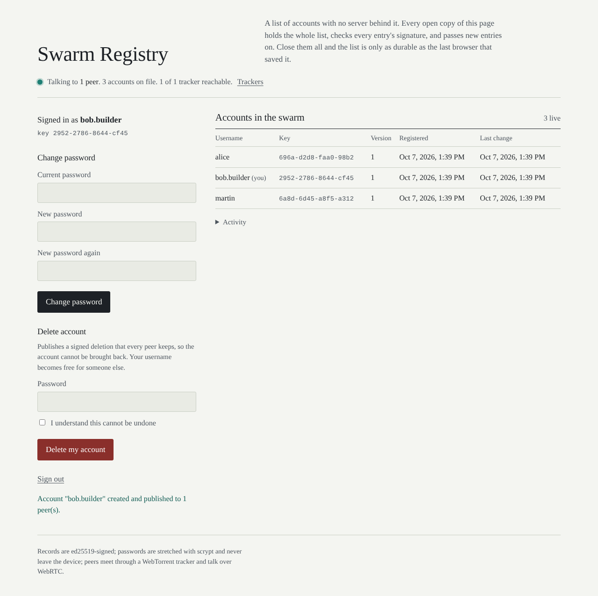

# YOU ARE THE INTERNET

## P2P webpage hosting in any browser, written 100% in javascript using torrents

Serverless web pages. Addressed by a key, served by whoever has a tab open.
A single HTML file ([`bep46-webrtc.html`](bep46-webrtc.html)) that runs in any
modern browser — no install, no server, no build. Open it and you can publish
a web page, visit someone else's page, or push an update to your own.

[LIVE DEMO](https://mrmartin.net/bep46-webrtc/bep46-webrtc.html) ·
[**the site**](https://mrmartin.net/bep46-webrtc/) — landing page, publisher,
Catwalk and Swarm Registry, all served by GitHub Pages straight from this
repository (see [The website](#the-website)).

## Example apps

Things built on this network. None of them has a server behind it.

### Swarm Registry — user accounts

A user database with create account / sign in / change password / delete
account, where the "database" is a set of signed records held by everyone
who has the page open. Each account is an ed25519 keypair; the secret key is
sealed under `scrypt(password)` and published in a signed record, so signing
in means decrypting your own key locally and the password never leaves the
device. Peers meet in a channel swarm (the same `sha1(…)` rendezvous trick as
the page publisher) and merge records by owner-signed sequence number, so
every peer converges on the same list whatever order things arrive in.

[**Live: mrmartin.net/bep46-webrtc/accounts**](https://mrmartin.net/bep46-webrtc/accounts/)



```bash
cd accounts && npm install
npm run tracker &      # local ws:// tracker for development
npm start              # http://127.0.0.1:8080/web/?tracker=ws://127.0.0.1:8000
npm run test:all       # 28 tests: logic, real tracker + wires, two Chromium browsers over WebRTC
```

Code, record format, threat model and what it deliberately does not protect
against: [`accounts/README.md`](accounts/README.md). `npm run build` there
produces a single self-contained HTML file, which is exactly what the page
publisher above takes as input — so the app and its user database can both
live in the swarm.

### Catwalk — a 2004 social network

[**Live: mrmartin.net/bep46-webrtc/catwalk**](https://mrmartin.net/bep46-webrtc/catwalk/)
(also on the tracker host, <https://bot.martintech.co.uk/catwalk/>) —
sign in as `mittens` (or any of the ten demo cats) with password `catnip2004`.

A parody of the original facebook, for cats, built on the accounts layer:
profiles with a little SVG cat, friend requests and confirmations, pokes, and
posts to everyone or to friends only. Friends-only posts are encrypted to your
friends with a per-author key that is re-issued when you unfriend someone, so
the browsers that relay them cannot read them. The page ships with a sample
network of ten cats, thirty posts and their friendships as real signed records,
so the very first visitor sees a living site — and becomes one of the browsers
that serves it.

```bash
cd catwalk && npm install
npm test               # 13 tests: records, privacy, replication, the sample data
npm run build          # dist/index.html — publish it with the page publisher above
```

Design, record format and the privacy model: [`catwalk/README.md`](catwalk/README.md).

The wrapper turns the underlying `bep46:` address — an ed25519 public key — into
something close to a URL. The bytes behind it are an HTML file, fetched over
WebRTC and rendered in a sandboxed iframe. The key holder can re-point the
address at new bytes at any time; everyone watching the address picks up the
new version on the next gossip round.

## What you can do from the homepage

The home screen has three options:

- **Create new content** — pick a single self-contained HTML file. A fresh
  ed25519 keypair is generated. The file is seeded over WebRTC and signed as
  version 1. You walk away with two strings: a **public address** to share and
  a **secret key** to keep. That's it; the page exists.
- **Visit a page** — paste a public address (`bep46:<64-hex>` or just the hex).
  The wrapper joins the swarm for that address, waits for the signed pointer,
  downloads the current version, and renders it inline with a small control
  bar at the top (address, version, peer count). You silently become a seeder
  of that version — so if the original author closes their tab, the page is
  still reachable as long as one visitor's tab is open.
- **Update your content** — enter the public address, paste (or load) the
  secret key, pick a new HTML file. The new bytes are seeded, a signed
  pointer with `seq+1` is broadcast, and anyone currently watching the address
  refreshes within one heartbeat (≤ 3 s).

## How it works

The wrapper sits on top of the original BEP-46 / WebRTC core (signed
mutable pointers gossiped through a WebTorrent rendezvous swarm at
`sha1(publicKey)`). The new bits are:

1. **HTML as the payload.** Every page is a single-file HTML, seeded under
   the fixed filename `index.html` — so the same content always produces the
   same infohash regardless of who's seeding, which is what makes
   cross-session re-seeding work.
2. **Sandboxed render.** The downloaded HTML is dropped into an `<iframe>`
   via `srcdoc`. The iframe is sandboxed with `allow-scripts allow-forms
   allow-popups allow-modals` — scripts can run, but the page cannot reach
   this app's storage or keys (no `allow-same-origin`).
3. **Persistent visitor seeding.** Every page you visit is cached in
   IndexedDB (`bep46-pages`) along with its sequence number and infohash.
   On every reopen of the wrapper, each cached page is automatically:
   - re-seeded (deterministic same-infohash reproduction), and
   - rejoined to its gossip channel,
   so you continue to serve every page you have ever visited, for as long as
   you keep coming back. If the wrapper hears a newer signed pointer for a
   cached page, it silently fetches and updates the cache in the background.
4. **Offline-first visit.** When you visit an address that's in your cache,
   the cached HTML is rendered immediately (no peer wait), and only refreshed
   if the swarm proves a newer signed version exists.
5. **Hash routing.** `#/`, `#/create`, `#/visit/<pubHex>`, `#/update`. Visit
   URLs are shareable — `bep46-webrtc.html#/visit/<key>` opens directly into
   the page viewer.
6. **Inter-page hyperlinks.** Pages link to each other with the `bep46:` URI
   scheme:
   ```html
   <a href="bep46:5db78acb26ca299fa77bd97a2a10ad793d005b1f16ae25eebebdf21d8aa05284">friend's page</a>
   ```
   A small shim is injected into every rendered page that catches clicks on
   these links and `postMessage`s the target address to the wrapper, which
   flips its hash. Authors don't need to know where the wrapper lives —
   it works the same whether `bep46-webrtc.html` is opened from `file://`,
   `mrmartin.net/files/`, htmlpreview, or anywhere else. Ctrl/Cmd-click and
   `target="_blank"` open the target in a fresh wrapper tab. The same shim
   exposes a `window.bep46 = { current, wrapperUrl, visit(addr) }` API for
   pages that want to navigate programmatically.

## Trust model

Same as the underlying BEP-46:

- The **public address** is the ed25519 public key. It is the canonical name
  of the page and cannot be forged.
- The **secret key** is the only capability to publish. Anyone holding it
  controls the address forever; lose it and the page becomes read-only
  forever. There is no recovery. The wrapper never sends it anywhere — it is
  used locally to sign and is offered as a downloadable `.key` file.
- Every pointer is `(seq, infohash)` signed by the secret. Peers reject any
  pointer whose signature doesn't verify, and any pointer whose `seq` is not
  strictly greater than what they already hold.

## Background — the protocol underneath

BitTorrent is permanent by design: a torrent is identified by the hash of its
own contents, so changing one byte makes a different torrent with a different
address. That is great for integrity and useless for anything that evolves.
[BEP 46 — *Updating Torrents Via DHT Mutable Items*](https://bittorrent.org/beps/bep_0046.html)
solves this: instead of sharing an infohash, you share an **ed25519 public
key**, the owner signs a small record that says "the current version is
infohash X" and publishes it to the BitTorrent DHT under `sha1(publicKey)`,
and anyone holding the public key polls that location for updates. BEP 46
builds on [BEP 44](https://bittorrent.org/beps/bep_0044.html) (signed mutable
items in the DHT).

The reference implementations (`lmatteis/dmt`, `RangerMauve/mutable-webtorrent`)
are Node.js because they depend on the UDP-based mainline DHT. A browser
cannot open a UDP socket, so a browser tab cannot join the mainline DHT, so
spec-literal BEP 46 is impossible from a web page.

This project keeps the **semantics** of BEP 46 — signed, owner-only,
sequence-numbered updates — and swaps the one piece a browser cannot have.
The mainline DHT is replaced by a **WebRTC rendezvous swarm**: every peer
interested in an address joins a WebTorrent swarm whose infohash is
`sha1(publicKey)`. That swarm carries no content; a custom wire-protocol
extension named `bep46` gossips the signed pointer record. This does **not**
interoperate with mainline BitTorrent or DHT-based BEP 46 clients — it is a
self-contained mutable-torrent network among peers running this page.

### The pointer record

```json
{
  "k":   "<64-hex ed25519 public key>",
  "seq": 3,
  "ih":  "<40-hex content infohash>",
  "sig": "<128-hex detached ed25519 signature>"
}
```

`ih` mirrors BEP 46's `v.ih` field. The signature covers a deterministic
28-byte message — **8-byte big-endian `seq` concatenated with the 20-byte raw
infohash** — so a record cannot be replayed at a different sequence number
or have its target swapped without invalidating `sig`.

### Heartbeat

Each channel re-broadcasts its current best record every 3 seconds, so a
peer that joins *after* a publish still syncs within one heartbeat.
`_ingest` silently drops anything that isn't strictly newer, so re-broadcasts
cost a signature verification and nothing else.

## Dependencies

[WebTorrent](https://webtorrent.io) (WebRTC transport) and
[TweetNaCl](https://tweetnacl.js.org) (ed25519). Both from a CDN. No build,
no bundler, no backend.

## Known limitations

- **Not mainline-interoperable.** By construction — see Background.
- **WebSocket trackers are scarce.** Browser WebTorrent needs `wss://`
  trackers for WebRTC signaling, and the public pool has thinned to almost
  nothing. This project therefore runs its own, `wss://bot.martintech.co.uk`
  (the stock [`bittorrent-tracker`](https://github.com/webtorrent/bittorrent-tracker)
  package behind nginx; status at <https://bot.martintech.co.uk/status>, numbers at
  <https://bot.martintech.co.uk/stats>), and it is first in the default
  tracker list, with the two public ones kept as fallbacks. To run your own,
  see [`TRACKER.md`](TRACKER.md).
- **Single-file HTML only.** The payload is one self-contained HTML — all
  CSS, JS, and assets must be inlined. No multi-file pages, no ``
  to local assets. (The underlying torrent can carry multiple files; the
  wrapper just doesn't expose that yet.)
- **Cross-session re-seeding is best-effort.** Re-seeding produces the
  original infohash only if WebTorrent's piece-splitting is deterministic
  for our inputs. The wrapper checks the resulting infohash against the
  cached one and only keeps the seed if they match; otherwise it logs a
  warning and skips.

## The website

<https://mrmartin.net/bep46-webrtc/> is GitHub Pages serving the `main` branch
of this repository exactly as it is. [`index.html`](index.html) is the landing
page, and everything it links to is a plain file in this tree:

| URL | What |
|---|---|
| `/` | the landing page, [`index.html`](index.html) |
| `/bep46-webrtc.html` | the page publisher |
| `/catwalk/` | Catwalk — [`catwalk/index.html`](catwalk/index.html) forwards to [`catwalk/web/`](catwalk/web/) |
| `/accounts/` | the Swarm Registry — [`accounts/index.html`](accounts/index.html) forwards to [`accounts/web/`](accounts/web/) |
| `/notes/friends-only-database.html` | a design note: [a database you share only with your friends](notes/friends-only-database.html) — passwords without a server, and replicating only among friends |

There is no build step and no CI: the apps load their ES modules and the
vendored libraries straight from the checkout (the same way `npm start` serves
them for development), and `.nojekyll` keeps GitHub from running the tree
through Jekyll. The landing page makes one network request of its own, to the
tracker's `/stats.json`, for the live peer count.

To get your own copy, fork the repository and switch on Pages in the fork:
**Settings → Pages → Deploy from a branch → `main`, `/ (root)`**. Any other
static host works the same way. The project's tracker host serves the same
tree at <https://bot.martintech.co.uk/>, with the built single-file apps at
`/catwalk/` and `/accounts/`.

## License

MIT.
